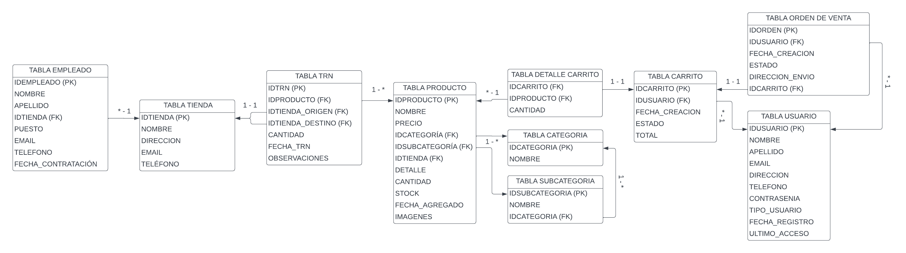

<center>

</center>


# <center>Entrega de proyecto final SQL</center>
@Alumna: Agustina Teme
@Comisión: 53175


---

## Tematica del proyecto
Este proyecto se centra en el desarrollo de un sistema integral de gestión para un comercio
electrónico llamado "EcomDB". La temática abarca todos los aspectos relacionados 
con la operación de una plataforma de ventas en línea, desde la gestión de productos y usuarios 
hasta la administración de pedidos y envíos. El sistema está diseñado para proporcionar una 
experiencia fluida tanto para los clientes como para los administradores del comercio electrónico.

## Modelo de negocio
1. **Gestión de Clientes y Empleados**: La base de datos permite registrar la información de los clientes que realizan compras, así como de los empleados involucrados en el proceso de ventas, como los encargados de almacén o atención al cliente.

2. **Gestión de Productos y Categorías**: Es importante clasificar los productos según su tipo, categoría o marca para organizar mejor la oferta y facilitar la búsqueda de los clientes. Esto incluye mantener un registro actualizado de los productos disponibles, su descripción, precio y cantidad en stock.

3. **Gestión de Carrito de Compras**: La base de datos permite a los clientes agregar productos a su carrito de compras mientras navegan por la plataforma. Esto requiere un sistema que registre los productos seleccionados, su cantidad y su asociación con el usuario que realiza la compra.

4. **Registro de Órdenes de Venta**: Al realizar una compra, se genera una orden de venta que registra los detalles de la transacción, incluyendo el cliente que realiza la compra, la fecha y hora de la compra, los productos adquiridos, la dirección de envío y el estado del pedido.

5. **Gestión de Transacciones**: Es necesario registrar todas las transacciones realizadas, incluyendo la fecha, los productos involucrados, la cantidad y las tiendas de origen y destino, si corresponde.

6. **Gestión de Empleados y Tiendas**: Se requiere gestionar la información de los empleados de las tiendas, incluyendo su puesto, sueldo y fecha de contratación, así como la información de las tiendas, como su nombre, dirección y contacto.


## Diagrama entidad relacion (DER)
<center>

</center>

## Listado de tablas y descripcion
| Tabla         | Columna            | Tipo de Datos                         |
| ------------- | ------------------ |                                  ---: |
| USUARIO       | IDUSUARIO          | INT                                   |
|               | NOMBRE             | VARCHAR(100) DEFAULT 'CLIENTE'        |
|               | APELLIDO           | VARCHAR(100) DEFAULT 'GENERICO'       |
|               | EMAIL              | VARCHAR(100) UNIQUE NOT NULL          |
|               | DIRECCION          | VARCHAR(255)                          |
|               | TELEFONO           | VARCHAR(100) NOT NULL                 |
|               | CONTRASEÑA         | VARCHAR(100)                          |
|               | TIPO_USUARIO       | VARCHAR(100)                          |
|               | FECHA_REGISTRO     | DATETIME                              |
|               | ULTIMO_ACCESO      | DATETIME                              |


| Tabla         | Columna            | Tipo de Datos                         |
| ------------- | ------------------ |                                  ---: |
| PRODUCTO      | IDPRODUCTO         | INT                                   |
|               | NOMBRE             | VARCHAR(100)                          |
|               | PRECIO             | INT                                   |
|               | IDCATEGORIA        | INT                                   |
|               | IDSUBCATEGORIA     | INT                                   |
|               | IDTIENDA           | INT                                   |
|               | DETALLE            | VARCHAR(100)                          |
|               | CANTIDAD           | INT                                   |
|               | STOCK              | BOOLEAN                               |
|               | FECHA_AGREGADO     | DATETIME                              |
|               | IMAGENES           | VARCHAR(100)                          |


| Tabla         | Columna            | Tipo de Datos                         |
| ------------- | ------------------ |                                  ---: |
| CARRITO       | IDCARRITO          | INT                                   |
|               | IDUSUARIO          | INT                                   |
|               | FECHA_CREACION     | DATETIME                              |
|               | ESTADO             | BOOLEAN                               |


| Tabla           | Columna            | Tipo de Datos                         |
| --------------- | ------------------ |                                  ---: |
| DETALLE_CARRITO | IDCARRITO          | INT                                   |
|                 | IDPRODUCTO         | INT                                   |
|                 | CANTIDAD           | INT                                   |


| Tabla         | Columna            | Tipo de Datos                         |
| ------------- | ------------------ |                                  ---: |
| EMPLEADO      | IDEMPLEADO         | INT                                   |
|               | NOMBRE             | VARCHAR(100)                          |
|               | APELLIDO           | VARCHAR(100)                          |
|               | IDTIENDA           | INT                                   |
|               | PUESTO             | VARCHAR(100)                          |
|               | SUELDO             | INT                                   |
|               | EMAIL              | VARCHAR(100) UNIQUE NOT NULL          |
|               | TELEFONO           | VARCHAR(100) NOT NULL                 |
|               | FECHA_CONTRATACION | DATETIME                              |


| Tabla         | Columna            | Tipo de Datos                         |
| ------------- | ------------------ |                                  ---: |
| TIENDA        | IDTIENDA           | INT                                   |
|               | NOMBRE             | VARCHAR(100)                          |
|               | DIRECCION          | VARCHAR(255)                          |
|               | EMAIL              | VARCHAR(100) UNIQUE NOT NULL          |
|               | TELEFONO           | VARCHAR(100) NOT NULL                 |


| Tabla         | Columna            | Tipo de Datos                         |
| ------------- | ------------------ |                                  ---: |
| TRN           | IDTRN              | INT                                   |
|               | IDPRODUCTO         | INT                                   |
|               | IDTIENDA_ORIGEN    | INT                                   |
|               | IDTIENDA_DESTINO   | INT                                   |
|               | CANTIDAD           | INT                                   |
|               | FECHA_TRN          | DATETIME                              |
|               | OBSERVACIONES      | VARCHAR(100)                          |


| Tabla         | Columna            | Tipo de Datos                         |
| ------------- | ------------------ |                                  ---: |
| CATEGORIA     | IDCATEGORIA | INT |
|               | NOMBRE | VARCHAR(100)    |


| Tabla         | Columna            | Tipo de Datos                         |
| ------------- | ------------------ |                                  ---: |
| SUBCATEGORIA  | IDSUBCATEGORIA     | INT                                   |
|               | NOMBRE             | VARCHAR(100)                          |
|               | IDCATEGORIA        | INT                                   |


| Tabla          | Columna            | Tipo de Datos                         |
| -------------- | ------------------ |                                  ---: |
| ORDENDEVENTA   | IDORDEN            | INT                                   |
|                | IDUSUARIO          | INT                                   |
|                | FECHA_CREACION     | DATETIME                              |
|                | ESTADO             | BOOLEAN                               |
|                | DIRECCION_ENVIO    | VARCHAR(255)                          |
|                | IDCARRITO          | INT                                   |


## Estructura e ingesta de datos
* Se realiza principalmente por medio del archivo population.sql
* La carga de la tabla orden de venta se realiza por medio de un csv colocado en el directorio ./structure/data-csv

## Objetos de la base de datos


### Documentacion de Vistas
### Vista: vista_productos_agotados

**Descripción:** Esta vista muestra todos los productos que están actualmente agotados en la tienda

**Columnas:**
* **IDPRODUCTO:** Identificador único de producto 
* **NOMBRE:** Nombre del producto
* **STOCK:** false porque está agotado

**Ejemplo de consulta:**

```sql
SELECT * FROM vista_productos_agotados;
```

### Vista: vista_ventas_mensuales

**Descripción:** Esta vista muestra el monto total de ventas por mes basado en los productos comprados en cada orden. 

**Columnas:**
* **MES:** Representa el mes en el que se realizaron las ventas.
* **VENTAS:** Representa el monto total de ventas en cada mes.

**Ejemplo de consulta:**

```sql
SELECT MES, VENTAS
FROM vista_ventas_mensuales;
```

### Vista: vista_empleados_por_tienda

**Descripción:** Esta vista muestra una lista de todos los empleados agrupados por tienda.
**Columnas:**
* **TIENDA:** Nombre de la tienda a la que pertenece el empleado.
* **NOMBRE:** Nombre del empleado.
* **APELLIDO:** Apellido del empleado.
* **PUESTO:** Puesto que ocupa el empleado en la tienda.

**Ejemplo de consulta:**

```sql
SELECT * FROM vista_empleados_por_tienda;
```

### Vista: vista_transacciones_pendientes

**Descripción:** Esta vista proporciona información sobre las órdenes de venta pendientes en el sistema, incluyendo el ID de la orden, el correo electrónico del usuario que realizó la orden, la fecha en que se creó la orden y el estado de la orden, donde "pendiente" indica que la orden aún no ha sido completada.
**Columnas:*** 
* **ID_ORDEN:** El ID único de la orden de venta.
* **USUARIO:** El correo electrónico del usuario que realizó la orden.
* **FECHA_ORDEN:** La fecha en que se creó la orden.
* **ESTADO:** El estado de la orden, donde "pendiente" indica que la orden aún no ha sido completada.

```sql
SELECT * FROM vista_transacciones_pendientes;
```

### Vista: vista_stock_por_tienda

**Descripción:** Esta vista proporciona información sobre la cantidad de productos disponibles en cada tienda.
**Columnas:*** 
* **TIENDA:** El nombre de la tienda.
* **CANTIDAD_PRODUCTOS:** La cantidad de productos disponibles en la tienda.

```sql
SELECT * FROM vista_transacciones_pendientes;
```

## Documentación de Funciones

### Función: calcular_precio_descuento

**Descripción:** Esta función calcula el precio de un producto después de aplicar un descuento.

**Parámetros:**

* **precio_base:** El precio original del producto.
* **descuento:** El descuento a aplicar al precio base, en porcentaje.

**Retorno:**

* **Entero:** El precio final del producto después de aplicar el descuento.

**Ejemplo de uso:**

```sql
SELECT calcular_precio_descuento(100, 20);
```

### Función: calcular_total_carrito

**Descripción:** Esta función calcula el precio total de un carrito sumando el precio de todos los productos en él.

**Parámetros:**

* **id_carrito:** El ID del carrito del que se desea calcular el precio total.

**Retorno:**

* **Entero:** El precio total del carrito.

**Ejemplo de uso:**

```sql
SELECT calcular_total_carrito(1001);
```

### Función: cantidad_orden_de_venta_usuario

**Descripción:** Esta función cuenta el número de órdenes de venta realizadas por un cliente dentro de un período de tiempo específico.

**Parámetros:**

* **usuario_id:**  El ID del cliente del que se desean contar las órdenes de venta.
* **fecha_inicio:**  La fecha de inicio del período de tiempo para el conteo de órdenes de venta.
* **fecha_fin:** La fecha de fin del período de tiempo para el conteo de órdenes de venta.

**Retorno:**

* **Entero:** El número total de órdenes de venta realizadas por el cliente dentro del período de tiempo especificado.

**Ejemplo de uso:**

```sql
SELECT cantidad_orden_de_venta_usuario(12345, '2024-01-01', '2024-03-31');
```

## Documentación de Triggers

### Trigger: actualizar_stock_al_agregar_producto

**Descripción:** Este trigger se encarga de actualizar automáticamente el stock de un producto en la tabla PRODUCTO cada vez que se agrega ese producto al carrito en la tabla DETALLE_CARRITO.

**Detalles:**

* **Tabla afectada:** PRODUCTO
* **Acción:** INSERT (Después de cada inserción en la tabla DETALLE_CARRITO, este trigger se activa para actualizar el stock del producto correspondiente en la tabla PRODUCTO.)
* **Información registrada:** No se registra información adicional en otra tabla. El trigger actualiza directamente el stock del producto en la tabla PRODUCTO.

**Ejemplo:** 
Supongamos que tenemos un producto en la tabla PRODUCTO con IDPRODUCTO igual a 1 y una cantidad inicial de 10 unidades en stock. Ahora, un cliente agrega 2 unidades de ese producto a su carrito.
Antes de que el cliente agregue el producto al carrito:
*Stock del producto con IDPRODUCTO igual a 1: 10 unidades
Después de que el cliente agregue el producto al carrito:
* Stock del producto con IDPRODUCTO igual a 1: 8 unidades (10 - 2)
 


## Roles y permisos

## Back up de la base de datos

## Herramientas y tecnologias usadas

## Como levantar el proyecto en CodeSpaces GitHub
* env: Archivo con contraseñas y data secretas
* Makefile: Abstracción de creacción del proyecto
* docker-compose.yml: Permite generar las bases de datos en forma de contenedores

#### Pasos para arrancar el proyecto