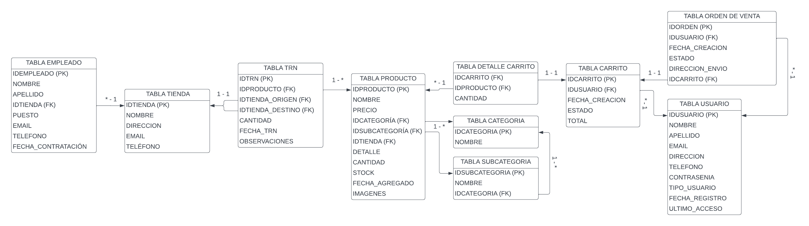

## Proyecto de Gestión de Ordenes de Venta - Trinity Ecommerce

#### Desarrollado por: Agustina Teme
### Problema:

El equipo de desarrollo de Trinity Ecommerce está trabajando en un sistema de gestión de ventas para su plataforma de comercio electrónico. Se requiere el diseño de una base de datos eficiente que pueda manejar todas las operaciones relacionadas con las ventas de manera óptima.

### Descripción del Problema:

1. **Gestión de Usuarios y Empleados**: Es necesario registrar la información de los usuarios que realizan compras, así como la de los empleados involucrados en el proceso de venta, como los encargados de atención al cliente.

2. **Gestión de Productos**: Se necesita clasificar los productos según su categoría y subcategoría para organizar el catálogo y facilitar la búsqueda para los clientes.

3. **Gestión de Carrito de Compras**: La base de datos debe permitir a los usuarios agregar productos a su carrito de compras, así como mantener un registro del estado y la fecha de creación del carrito.

4. **Gestión de Detalle de Carrito**: Es fundamental mantener un registro detallado de los productos agregados a cada carrito de compras, incluyendo la cantidad de cada producto.

5. **Gestión de Empleados y Tiendas**: Se requiere gestionar la información de los empleados de las tiendas, incluyendo su puesto, sueldo y fecha de contratación, así como la información de las tiendas, como su nombre, dirección y contacto.

6. **Gestión de Transacciones**: Es necesario registrar todas las transacciones realizadas, incluyendo la fecha, los productos involucrados, la cantidad y las tiendas de origen y destino, si corresponde.

7. **Gestión de Categorías y Subcategorías**: Se necesita organizar los productos en categorías y subcategorías para facilitar la navegación y búsqueda de los clientes.

8. **Gestión de Órdenes de Venta**: Es fundamental mantener un registro detallado de todas las órdenes de venta realizadas, incluyendo la fecha y hora de creación, el usuario que realizó la orden, el estado de la orden, la dirección de envío y el carrito de compras asociado.

### Objetivo:

Diseñar e implementar una base de datos relacional que satisfaga todas las necesidades de gestión de ventas para Trinity Ecommerce. La base de datos debe ser eficiente, escalable y fácil de mantener, permitiendo una gestión ágil y precisa de todas las operaciones relacionadas con las ventas.

### Esquema de la Base de Datos:

